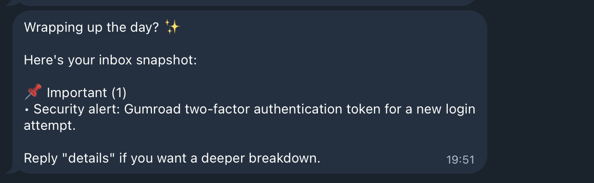

# AI Inbox Manager — Reduce Email Noise by 90%

👉 **Visual breakdown of how this works (diagram + steps):**  
https://www.moneda-app.com/systems/ai-inbox-manager/?ref=github

👉 **Want this to run automatically (no manual triggers)?**  
Get the Pro version: https://hpychan.gumroad.com/l/ai-inbox-manager-pro?ref=github

---

Reduce email noise by 90% — automatically.

Only see what matters. Ignore the rest.

Most people waste **2–4 hours/day** checking email.  
This system removes the noise completely.

This workflow scans your inbox and sends a clean summary of important emails to Telegram.  
No coding required. Setup takes ~3–5 minutes.

---

## ⚡ Quick Start (2 minutes)

1. Import `PA_Gmail_Triage_FREE.json` into n8n.
2. Connect credentials:
   - Gmail
   - Gemini (AI)
   - Telegram

👉 [Follow the Quick Setup section below](#quick-setup-5-minutes)

3. Set your Telegram `chatId`.
4. Click **"Execute workflow" on the Manual Trigger node** to test.

You should receive a message in Telegram.

---

## 📬 Expected Output

You will receive a Telegram message like:

📬 AI Inbox Summary  
🔥 1 Important Email  
• Subject: Login alert  
• Action: Review immediately  

If you see this message, your setup is working correctly.

---

## ✅ What you'll get

- Detects important emails automatically  
- Sends a clean summary to Telegram  
- No auto-delete or risky actions (safe to try)

---

## ⚠️ Important

- The workflow runs manually in the free version.
- `Gmail Trigger` is disabled by default for safety.
- Only enable it after testing successfully.

---

## 🛠️ Troubleshooting

**No Telegram message?**
- Check your `chatId`.
- Make sure your bot has received at least 1 message from you.

**No emails found?**
- Make sure you have unread emails.
- Check Gmail credentials.

---

## ⚙️ Quick Setup (5 minutes)

### 1. Gmail (OAuth)
- Click `Add credential` in n8n.
- Select Gmail.
- Login with your account.

✔ Connected

---

### 2. Gemini (AI)
- Go to https://aistudio.google.com
- Create API key
- Paste into n8n credential

✔ Connected

---

### 3. Telegram Bot
- Open Telegram
- Search: `BotFather`
- Run: `/newbot`
- Copy bot token
- Message your bot once

✔ Connected

---

### 4. Get Chat ID
Open in browser:

https://api.telegram.org/bot<TOKEN>/getUpdates

Look for:

"chat": { "id": XXXXX }

Use this number as your `chatId`.

---

# 🚀 Upgrade to Pro — Fully automate your inbox

The free version shows you what matters.

The Pro version turns this into a fully automated system.

👉 Setup once. Runs automatically every hour.

No coding required. Same setup as free version.

---

## 🔥 What changes in Pro:

- Runs automatically every hour (no manual trigger)
- Extracts tasks → Google Tasks
- No need to constantly check your inbox
- Smarter AI filtering (fewer false positives)
- Clean, structured summaries (ready to act)

---

## 🧠 Real outcome:

Instead of checking email 10–20 times/day  
👉 You check Telegram only when needed

---

💡 If you're checking email more than 5 times/day, you need automation.

👉 **Want this to run automatically (no manual triggers)?**  
https://hpychan.gumroad.com/l/ai-inbox-manager-pro?ref=github

👉 **Get Pro (set once, runs forever)**  
https://hpychan.gumroad.com/l/ai-inbox-manager-pro?ref=github